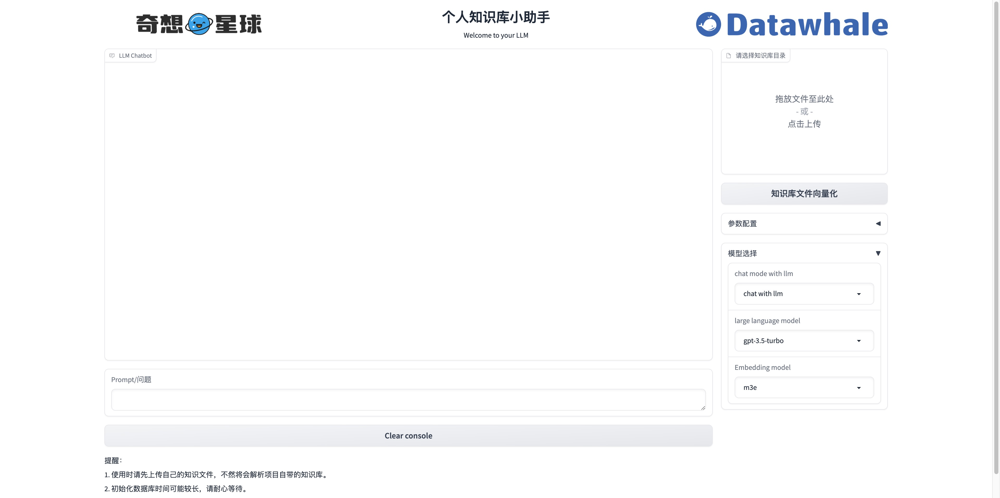
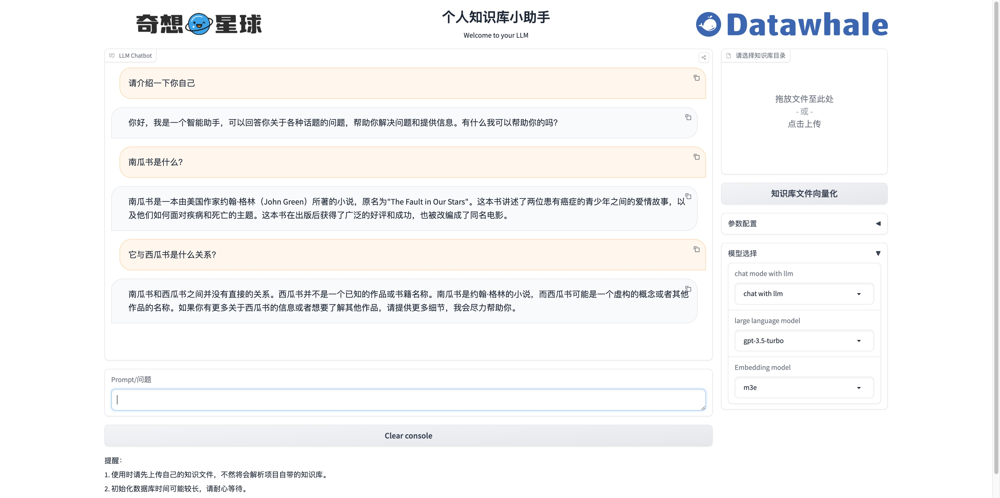
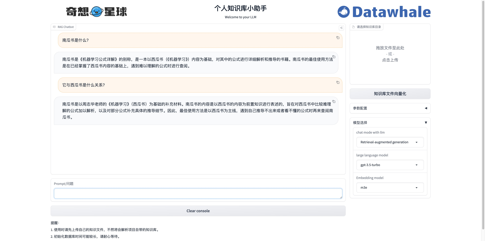

# 个人知识库助手项目

基于LangChain实现的个人知识库助手项目，可以实现与大语言模型的交互以及创建自己的个人知识库。


## 项目亮点

- 封装了目前主流的大语言模型，包括OpenAI GPT大模型、百度文心大模型、讯飞星火大模型、智谱AI大模型。提供统一的接口，使得用户可以避免复杂的封装细节，直接调用相应的大模型；
- 利用检索增强技术（RAG）有效缓解大语言模型“幻觉”问题；
- 支持用户自上传知识库，支持上传单个pdf、md、txt文件，也支持上传文件夹；
- 向量数据库采用Chroma，支持m3e和OpenAI embedding，支持逐级递归地分割文本，向量数据库检索采用BM25算法和向量相似度混合检索；
- 基于langChain链式结构支持上下文追踪和多轮对话。

**项目开始界面**


**问答演示界面（无RAG）**


**问答演示界面（有RAG）**


## 项目启动

- 克隆储存库

```shell
git clone https://github.com/xiaoWen9246/Chat_with_LLM.git
cd Chat_with_Datawhale_langchain
```

- 创建 Conda 环境并安装依赖项

```shell
# 创建 Conda 环境
conda create -n llm-universe python==3.9.0
# 激活 Conda 环境
conda activate llm-universe
# 安装依赖项
pip install -r requirements.txt
```

- 启动服务为本地 API

```shell
# Linux 系统
cd serve
uvicorn api:app --reload 
```

```shell
# Windows 系统
cd serve
python api.py
```
- 运行项目
```shell
cd serve
python run_gradio.py -model_name='gpt-3.5-turbo' -embedding_model='m3e' -db_path='../../data_base/knowledge_db' -persist_path='../../data_base/vector_db'
```
